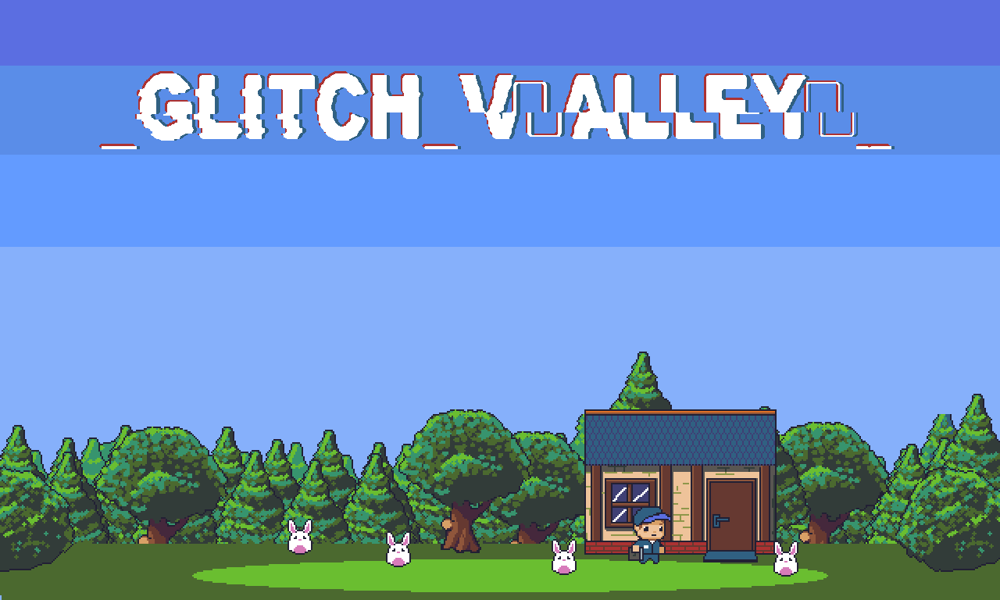
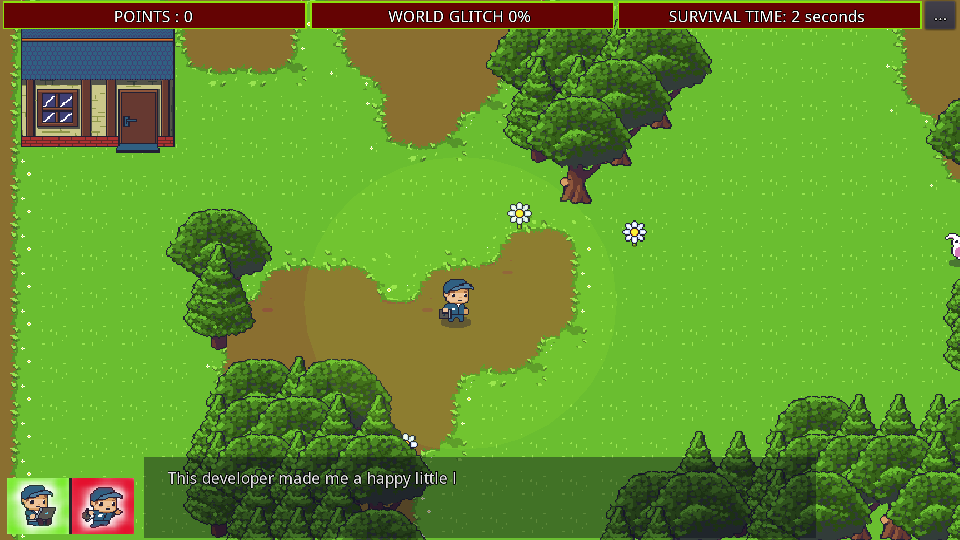
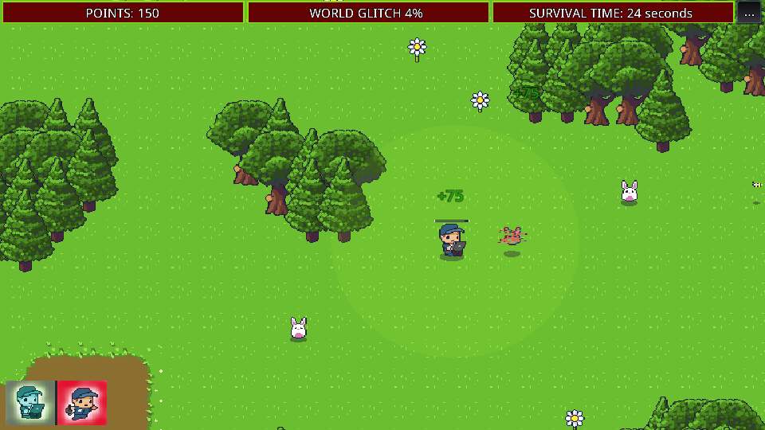
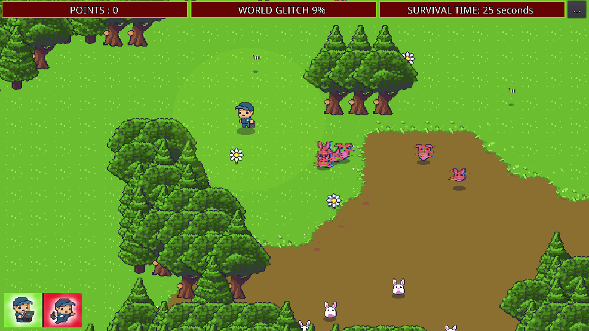

# Glitch Valley

A unique action-adventure game built with Godot 4.4 where you play as a digital maintainer in a glitch-infested world. Your mission is to repair and restore balance to a valley that's being corrupted by mysterious glitches.



## 🎮 Game Features

### Core Gameplay
- **Glitch Repair Mechanic**: Fix corrupted objects and creatures in the valley
- **Dynamic World**: Procedurally generated forest environment
- **Real-time Action**: Fast-paced gameplay with dash and repair abilities
- **Score System**: Earn points by fixing glitches and helping creatures

### Player Abilities
- **Repair Power**: Fix glitched objects within a certain radius
- **Dash Movement**: Quick escape or traversal ability with ghost trail effect
- **Camera Control**: Dynamic zoom functionality for better awareness
- **Stamina System**: Manage your energy while using abilities

### World Elements
- **Glitchable Objects**:
  - Rabbits: Can become corrupted and need fixing
  - Flowers: May glitch and require repair
  - Bees: Can be affected by the corruption
  - Environmental tiles: Various terrain elements that can become glitched

### Technical Features
- Built with Godot 4.4
- Procedural map generation using FastNoiseLite
- Modern tilemap implementation using TileMapLayer system
- Signal-based event system for loose coupling
- Configurable gameplay parameters
- Screen shake effects for impactful actions

## 🎯 Game Objectives
1. Explore the procedurally generated valley
2. Find and repair glitched objects and creatures
3. Manage your stamina and timing for abilities
4. Achieve high scores by efficiently fixing corruptions
5. Prevent the spread of glitches throughout the environment

## 🔧 Configuration
The game features various configurable parameters:
```gdscript
{
    "GlitchHappenChance": 0.0,
    "GlitchIncreaseFactor": 0.05,
    "BeesCount": 1,
    "RabbitsCount": 500,
    "FlowerCount": 1,
    "PointMultiplier": 1.0
}
```

## 🎨 Art Assets
- Custom pixel art for characters and objects
- Animated sprites for player actions and effects
- Tileset-based environment design
- Special effects for glitch visualization

## 🔊 Sound
The game features various sound effects and music:
- Player footsteps
- Ambient bee buzzing
- Background music tracks:
  - "Fretless" by Kevin MacLeod
  - "Shades of Spring" by Kevin MacLeod

## 🛠 Development
This game was developed for the Godot Wild Jam 10, showcasing various game development techniques and Godot 4.4 features:
- Modern GDScript with strict typing
- Signal-based event architecture
- Component-based design
- Procedural content generation
- Dynamic difficulty scaling

## 🎥 Screenshots




## 🔄 Installation & Running
1. Clone the repository
2. Open the project in Godot 4.4 or later
3. Run the main scene

## 🎮 Controls
- **Movement**: Arrow keys or WASD
- **Repair**: [Space]
- **Dash**: [Shift]
- **Camera Zoom**: Mouse wheel or designated keys
- **Debug Controls**:
  - Generate New World: [G]
  - Toggle Rabbit Glitch: [R]
  - Toggle Flower Glitch: [F]
  - Toggle Bee Glitch: [B]

## 📝 License
[Add your license information here]

## 👥 Credits
[Add credits for team members, assets, and music here] 